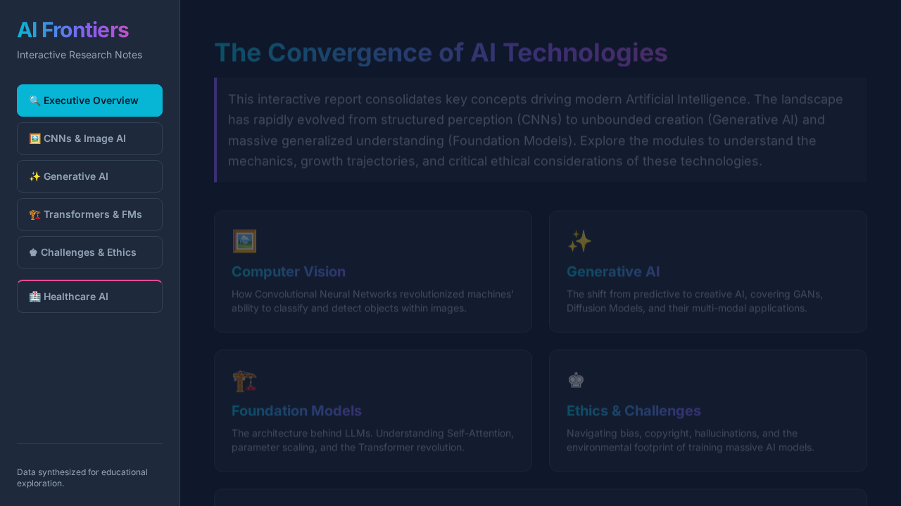
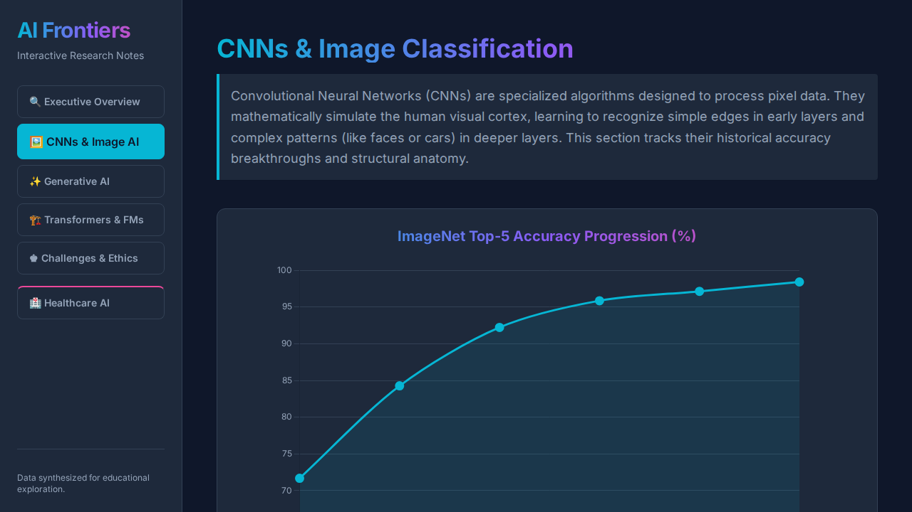
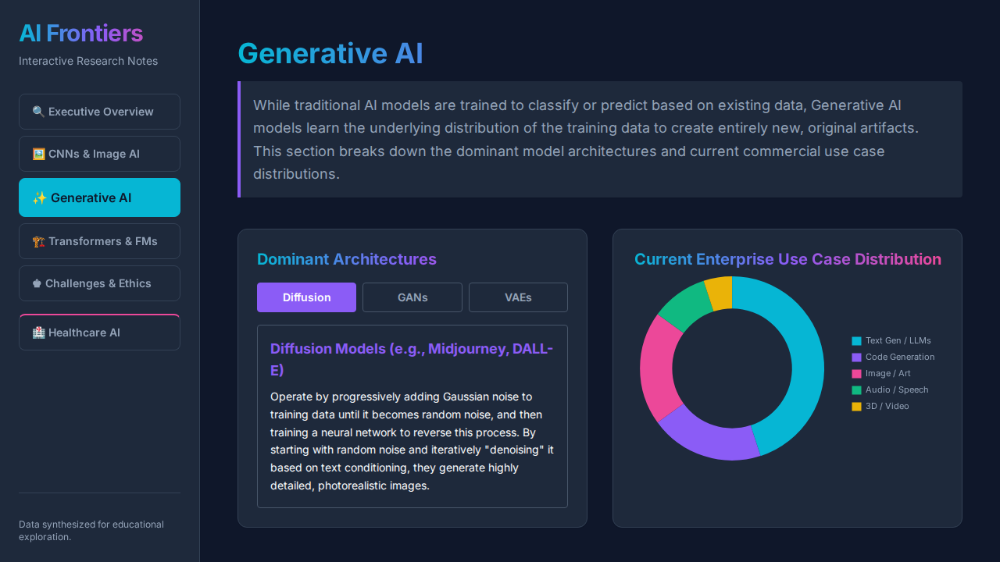

# AI Frontiers: Interactive Research Report

Welcome to the **AI Frontiers** interactive research report! This repository contains a single-page application (SPA) built with HTML, Tailwind CSS, and Chart.js. The application serves as an interactive, educational overview of the key concepts driving modern Artificial Intelligence.

## 🌐 Website Link
<a href="https://example.com" target="_blank" rel="noopener noreferrer">Live Demo Website</a>

## 📌 Features & Modules
The application is structured into five core thematic modules:

- **Executive Overview:** A high-level introduction to the convergence of AI technologies, from structured perception to massive generalized understanding.
- **CNNs & Image AI:** Tracks historical accuracy breakthroughs and visualizes the structural anatomy of Convolutional Neural Networks.
- **Generative AI:** Explains the shift from predictive to creative AI, detailing architectures like GANs, Diffusion Models, and VAEs.
- **Transformers & Foundation Models:** Demystifies self-attention mechanisms and visualizes the exponential growth of foundation models.
- **Challenges & Ethics:** Explores the socio-technical risks of AI, including bias, copyright, hallucinations, and environmental impact.
- **Healthcare AI:** Dives into clinical models, radiomics, and handling high-dimensional healthcare data.

## 📸 Screenshots

### Executive Overview
The main entry point providing a comprehensive overview of the modules.


### CNNs & Image Classification
Interactive diagrams and charts showing ImageNet progression and CNN layers.


### Generative AI
Visualizations of current enterprise use case distributions and dominant architectures.


## 🛠️ Tech Stack
- **HTML5:** Semantic structure.
- **Tailwind CSS:** Responsive, modern styling.
- **Chart.js:** Interactive data visualizations.

## 🚀 How to Run Locally
1. Clone this repository to your local machine.
2. Open `index.html` directly in your browser, or start a local HTTP server:
   ```bash
   python -m http.server 3000
   ```
3. Navigate to `http://localhost:3000` to view the application.